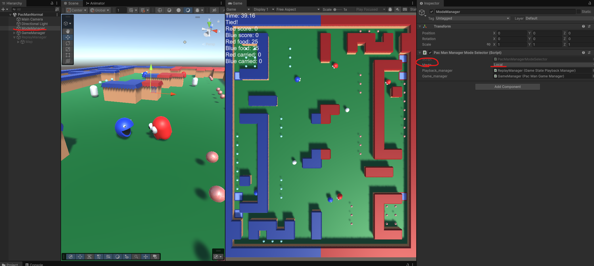
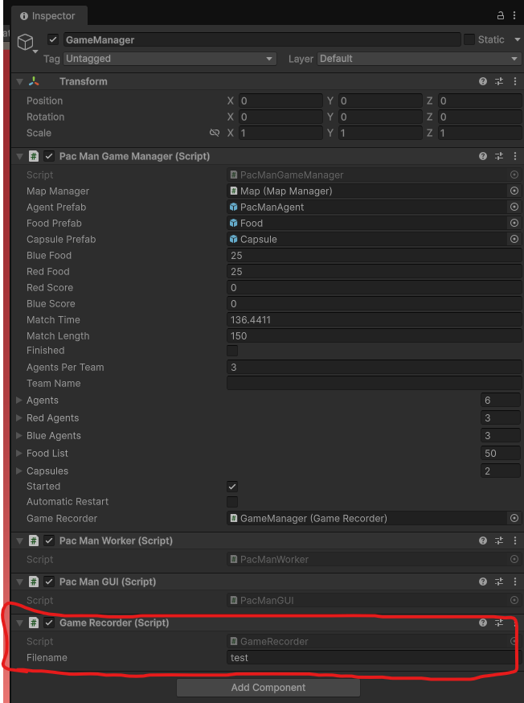
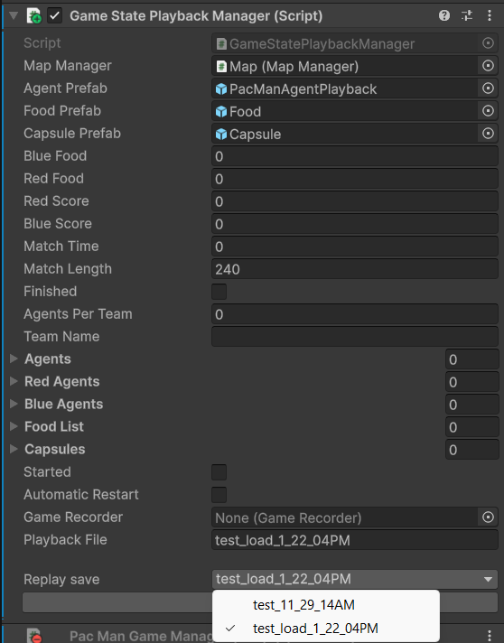
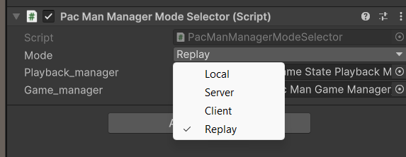
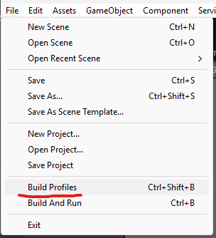
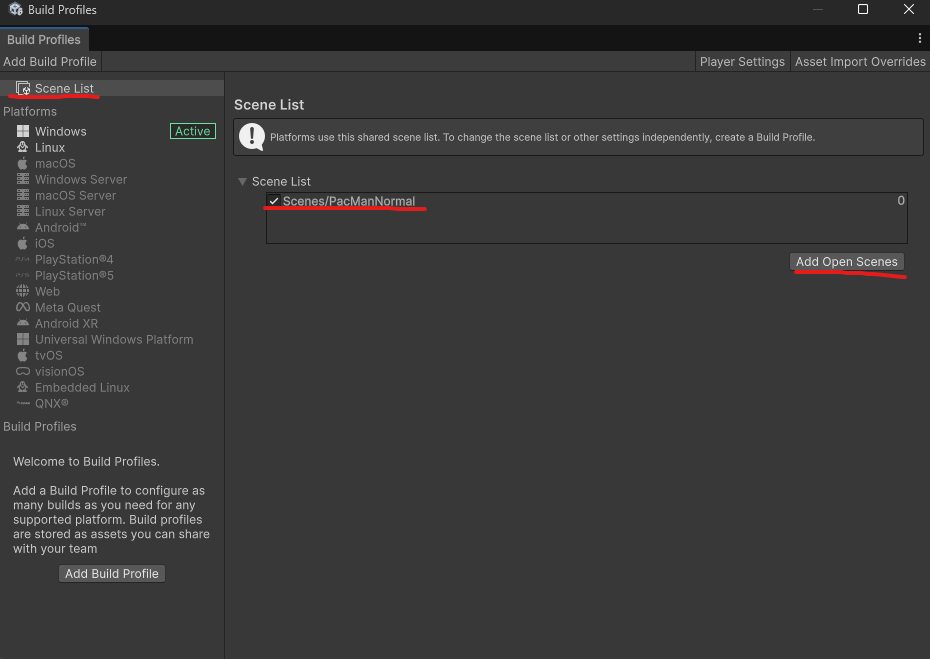
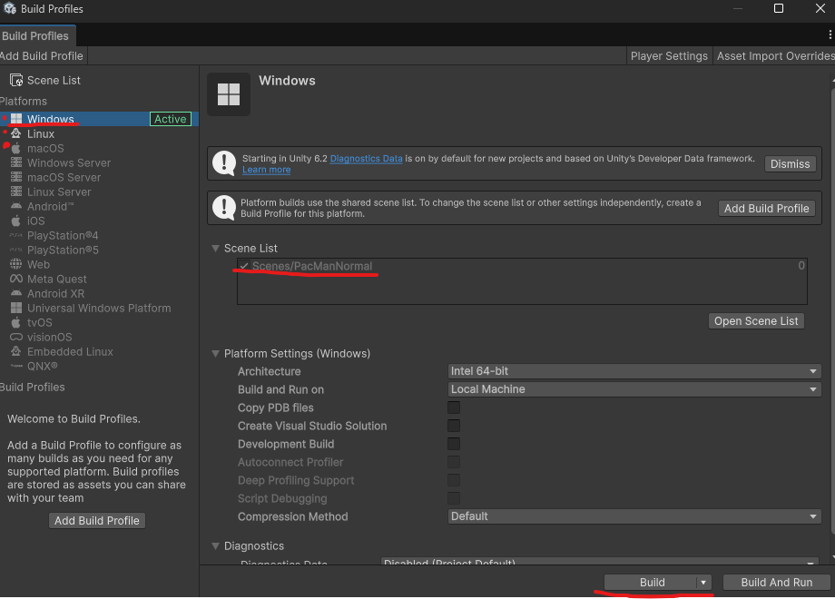
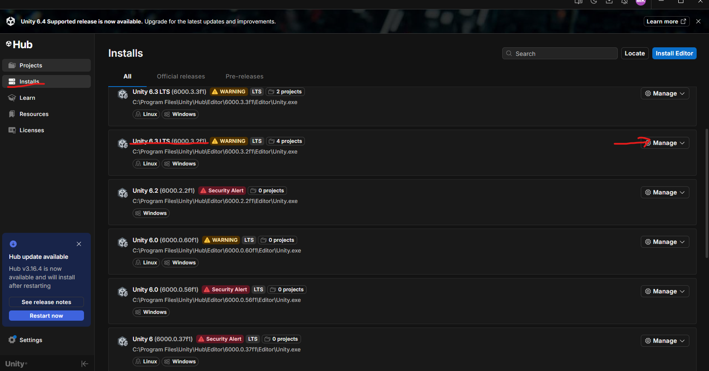
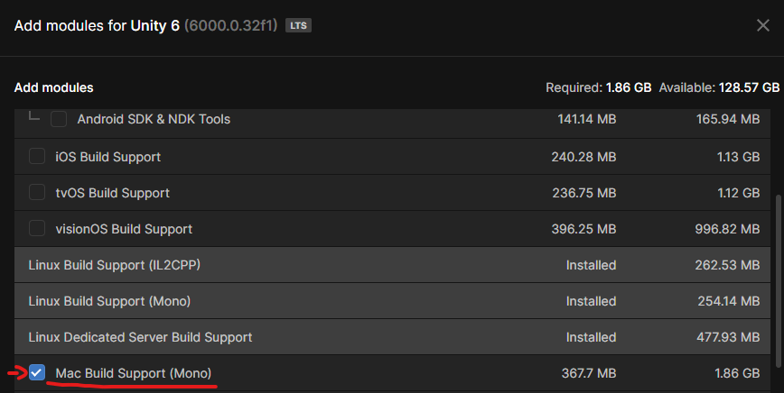

# PacMan Capture-The-Flag assignment

Inspired by UC Berkeley's Python environment: https://inst.eecs.berkeley.edu/~cs188/fa24/projects/

The Capture-the-flag game is played by two opposing teams, the red and the blue (see images below). In order for your team to be able to compete against other teams, without sharing source code and thereby exposing your brilliant code too early, we utilize the unity features of creating executables.

You will build your AI code into the [PacManAI](Assets/Scripts/PacManAI.cs) class, as in the previous assignments.
However, to manage the competitions we have provided a networked version of the game as well, using a custom synchronized HTTP server, on top of Protobuf messages.

We strongly suggest you test out your solutions in both **Local** and **Client/Server** mode **_AS EARLY AS POSSIBLE_**.
Otherwise you might run into unexpected issues during competitions.

It is possible to run the environment in one three ways:
- Normal Unity scene without networking (Local)
- Networked Client / Server 
- Replay mode 



## Local

The local mode can be a convenient mode for testing changes quickly.

In the local mode, everything is run on one instance of the environment - as in previous assignments.
This is done by starting the unity editor as usual, picking the PacManNormal scene, and pressing play. To test things out you can control both sides using wasd and arrow keys.

Doing this you are running the environment with "Mode: Local" in PacManManagerModeSelector or by disabling the mode selector entirely.

Or alternatively from the command line, with the following command (assuming an executable named "PacManCTF"):
```
./PacManCTF -mode local
```
If you have a Mac, check instructions for running an executable from the terminal at the bottom of this page.

## Client / Server

In this mode, 3 instances of the application are necessary to run the game. Therefore, a built artifact is required to launch it in this manner. See below.

Once you have the executable, you can either:
- Run it 3 times to start 1 server and 2 clients. The server should be started first.
- Alternatively using this command (assuming an executable named "PacManCTF"):
```
 ./PacManCTF -mode server & ./PacManCTF -mode client & ./PacManCTF -mode client
```

The game is **server authoritative.** All data that is not supposed to be seen by the Client does not exist on the Client. Actions constructed on the client are sent to the server for execution and played back on the Client.

The game is **fully synchronous**. The server waits for both clients to send in their actions before stepping the environment. Thus if your executable never sends an action the game will not progress. This will not be a way to escape losing, so avoid it. Details on available computation time can be found on Canvas.

It is suggested you test your algorithms out in both modes.
Note that the **final competitions will be in Client/Server mode**, to enable you to share built executables and run games against other teams without having to manage their code.


## Replay

### Saving a replay

To store a replay, enable the GameRecorder component and set a file name or enable from CLI (see below).

### Playing a replay




To play back a replay, in the editor, **Change the game mode to Replay** and **select a file under the ReplayManager**. Then start the game in the editor. 


## Other command line options

It is possible to manually change the port of an executable 

```
 ./PacManCTF -port <number> -mode server
```

Or the map to be loaded during startup

```
 ./PacManCTF -map <name> 
```

Valid map names can be found in the map manager, as in previous assignments. A valid example would be
```
 ./PacManCTF -map pacmanA
``` 

Or enable recorder output for a server instance and choose the recording file base name

```
 ./PacManCTF -mode server -recording <name>
```
The `-recording` option is only applied on the server. When present, it forces the server-side `GameRecorder` to be active and uses `<name>` as the file base name.

# Building an executable



It is best to build a single scene into the executable at once, unless you know what you are doing and how to select scenes.



You can change the Target Platform in order to build versions that can be used by people on other plaforms.
In order for that to be available you have to add the corresponding modules to the version of the engine you are using (see below).



NB! When building for different platforms, do not open or launch any of the files!
Some filesystems will cause the files to become corrupted and not launchable on the target platform.

If for some reason some of the platforms are grayed out, you can add support for those as follows:



Your editor version might differ.



Do not forget to restart your editor after installing new support modules.

NB! On some platforms you might need to delete your old build artifacts if you wish to build an artifact into the same folder as a previous one to see any changes.

Once the executable is built, you can run it directly  as any other application using the commands in the sections above.

# If you have a Mac
To run a Unity executable from the terminal on a Mac, you have to write a bit more. In macOS, an app is actually a folder, so assuming myApp is the name of the executable, instead of writing

```
 ./myApp 
```
you write
```
 ./myApp.app/Contents/MacOS/PacManCTF 
```
and add flags and arguments after as described above. Note that you can access the folders inside the executable using the `ls` command from the terminal as usual. On a Mac, the longer example above, to start both clients and server, would be:
```
./myApp.app/Contents/MacOS/PacManCTF -mode server & ./myApp.app/Contents/MacOS/PacManCTF -mode client & ./myApp.app/Contents/MacOS/PacManCTF -mode client
```
### Executable permissions for external executables

If you have an executable from a different machine your terminal will probably complain about permissions, in such case use the following commands in the terminal to be able to run the app.

Assuming a build called "Mac.app" :

```
sudo xattr -dr com.apple.quarantine Mac.app
sudo chmod +x ./Mac.app/Contents/MacOS/PacManCTF
```
